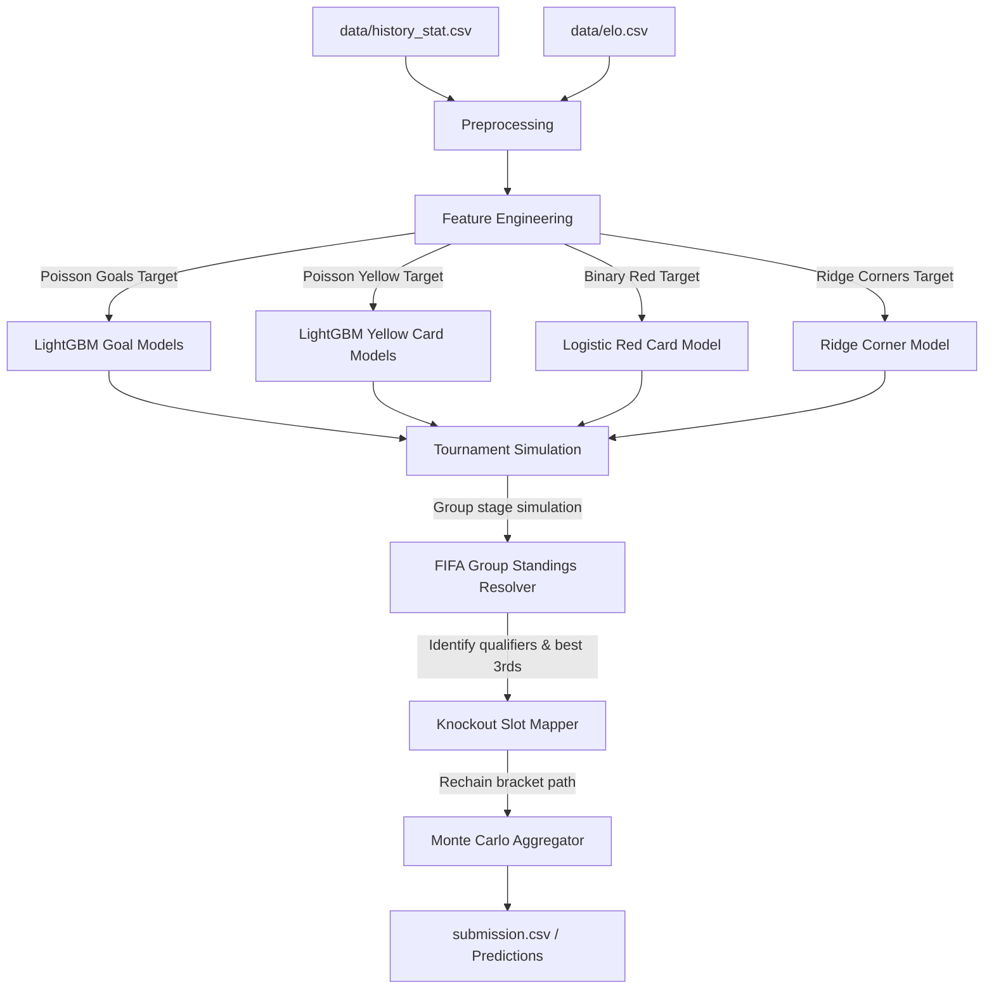

# FIFA World Cup 2026 Prediction Model: System Architecture & Improvement Spec

This document details the complete system architecture of the prediction model pipeline for the FIFA World Cup 2026 DataCamp competition. It outlines the current pipeline components (Preprocessing, Feature Engineering, Modeling, and Tournament Simulation) and details high-impact, data-driven improvements that can be built using only the existing repository data.

---

## 1. Current Architecture Overview

The system operates as a multi-stage ML forecasting and Monte Carlo simulation pipeline:



### Preprocessing (`preprocessing.ipynb`)
- **Historical Scope:** Combines historical match logs (`history_stat.csv`) dating back to 1872 with team Elo ratings (`elo.csv`) and former team names (`former_names.csv`).
- **Team Names Mapping:** Maps historical names and play-off names (e.g. `UEFA Playoff A` to specific play-off qualifiers, and `USA` to `United States`) to keep team names standardized across all datasets.
- **Match Sequencing:** Groups all matches chronologically to form individual team performance history chains (`get_team_hist`).

### Feature Engineering (`feature_engineering.py`)
- **Elo Difference (`elo_diff`):** Merges Elo scores of the home and away teams and computes the difference:
  $$\text{elo\_diff} = \text{home\_elo} - \text{away\_elo}$$
- **Tournament Weights:** Assigns importance factors to matches based on tournament type. World Cup matches receive a multiplier weight of `1.3`, while friendlies and minor tournaments receive a weight of `1.0`.
- **Rolling Attack/Defense Rates:** Computes a team's scoring capability and defensive resilience using their last 10 games:
  - If a team has $\le 5$ games, rates are computed as weighted average goals scored/conceded, linearly interpolated with a default rate of `1.0` (weight = $N/5$, where $N$ is number of matches).
  - If a team has $6$ to $10$ games, the average of the last 5 games is weighted at `70%` and the preceding 5 games at `30%`.
- **Home Host Advantage:** Checks whether the home team is one of the three hosts (USA, Canada, Mexico) and is playing in one of their host cities, applying a host nation flag.
- **Synthetic Card/Corner Generators:** Because historical card and corner data are not present in `history_stat.csv`, the pipeline generates synthetic targets (`pseudo_yellow`, `pseudo_red`, and `pseudo_corners`) for training:
  - **Yellow/Red Cards:** Uses a hardcoded static lookup dictionary (`TEAM_DISCIPLINE`) containing values for only 34 countries (e.g., Argentina = 2.4, England = 0.2). Teams not in the dictionary receive the global mean.
  - **Corners:** Uses a pressure model based on team attack rates and opponent defense ratings:
    $$\text{pressure} = \text{attack} + (1.0 - \text{opponent\_defense})$$
    The corner counts are drawn using Poisson distributions based on pressure difference.

### Machine Learning Models (`models.ipynb`)
The pipeline runs separate models for goals, cards, and corners to capture their unique distributions:
1. **Goals (`home_goals` & `away_goals`):** LightGBM Regressors (`LGBMRegressor`) configured with a Poisson loss objective (`objective='poisson'`).
2. **Yellow Cards (`home_yellow` & `away_yellow`):** LightGBM Regressors trained on the synthetic target values with a Poisson loss objective.
3. **Red Cards (`home_red` & `away_red`):** Logistic Regression models predicting the probability of $\ge 1$ red card in a match.
4. **Corners (`home_corners` & `away_corners`):** Ridge Regression model optimizing Mean Absolute Error (MAE) loss.

### Tournament Simulation (`simulations.py` & `helpers.py`)
- **Match-Level Draw:** Goals, corners, and yellow cards are drawn using Poisson distributions with lambda parameters predicted by the models. Red cards are simulated as Bernoulli trials using the logistic regression probabilities.
- **Extra Time & Penalties:** For knockout matches ending in a draw at 90 minutes, an extra-time period is simulated with an expected total of `0.8` goals, split between teams based on their relative goal lambdas. If still tied after extra time, a 50/50 coin flip determines the penalty shootout winner.
- **Group Stage Standings:** Simulates all group stage fixtures. Tiebreakers are resolved sequentially using FIFA's official rules: **Points $\rightarrow$ Goal Difference $\rightarrow$ Goals For $\rightarrow$ Yellow Cards $\rightarrow$ Red Cards**.
- **Knockout Bracket Rechaining:** Implements a Monte Carlo simulation ($N$ iterations). Because knockout slots (e.g., Winner Match 73 vs Winner Match 75) are conditional, the simulation dynamically resolves the qualifiers at each round, updating the matchups sequentially.
- **Monte Carlo Aggregator:** Aggregates outputs over all iterations to identify the most common scores and winners for each match, formatting them for the final submission.

---

## 2. Recommended Improvements (Purely Data-Driven)

These high-impact improvements are structured to use **only the existing data** in `history_stat.csv` and `elo.csv`.

---

### Improvement 1: Recency Weighting for Model Training
**Problem:** The current setup treats historical matches from the late 1800s or mid-1900s with the same weight as modern matches. Modern football tactics, fitness, and scoring trends differ significantly.
**Solution:** Apply a sample weight to each historical match during model training. The weight decays exponentially or linearly based on the match date.

#### Implementation:
```python
def compute_recency_weights(df, current_year=2026, half_life_years=15):
    """
    Computes exponential decay weights for historical matches.
    Matches closer to the tournament year receive weights closer to 1.0.
    """
    df = df.copy()
    df['date'] = pd.to_datetime(df['date'])
    df['year'] = df['date'].dt.year
    
    # Calculate years elapsed
    years_elapsed = current_year - df['year']
    
    # Exponential decay formula
    weights = np.exp(-np.log(2) * years_elapsed / half_life_years)
    
    # Set a minimum floor weight to prevent total loss of older matches
    return np.clip(weights, 0.05, 1.0)
```
*How to apply in `models.ipynb`:*
Pass the computed weight vector as the `sample_weight` parameter in LightGBM and Ridge models during training:
```python
model.fit(X_train, y_train, sample_weight=train_weights)
```

---

### Improvement 2: Rolling Recent Form (Streak) Features
**Problem:** Rolling attack/defense rates represent average scoring over 10 games, but they do not capture recent momentum (e.g. winning streaks vs losing slides) or the quality of recent opponents.
**Solution:** Engineer a rolling recent form feature mapping the points won (Win = 3, Draw = 1, Loss = 0) in the last 3 to 5 matches, adjusted for opponent strength.

#### Implementation:
```python
def get_team_form(team_hist, team, current_date, window=5):
    """
    Computes a form index based on points earned in the team's last N matches.
    """
    history = team_hist.get(team, [])
    # Filter for matches prior to target date
    history = [h for h in history if h.date < current_date]
    
    if not history:
        return 1.0  # Default neutral form
        
    recent_matches = history[-window:]
    points = []
    
    for h in recent_matches:
        if h.home_team == team:
            if h.home_score > h.away_score:
                points.append(3)
            elif h.home_score == h.away_score:
                points.append(1)
            else:
                points.append(0)
        else:
            if h.away_score > h.home_score:
                points.append(3)
            elif h.away_score == h.home_score:
                points.append(1)
            else:
                points.append(0)
                
    # Average points per match scaled to [0, 1] range
    points_avg = np.mean(points) if points else 1.0
    return points_avg / 3.0
```
Update `add_match_features` in `feature_engineering.py` to add `home_recent_form` and `away_recent_form` as model input features.

---

### Improvement 3: Historical Head-to-Head (H2H) Matchup Features
**Problem:** Matchups between historical rivals (e.g., Brazil vs Argentina, England vs Germany) often carry mental and tactical biases that standard rolling goals stats do not capture.
**Solution:** Look up the past $N$ matchups between the two teams and compute the historical goals difference and win share.

#### Implementation:
```python
def get_h2h_features(team_hist, team_a, team_b, current_date, max_lookback_years=15):
    """
    Retrieves historical matchup statistics between two teams within a lookback window.
    """
    history_a = team_hist.get(team_a, [])
    h2h_matches = []
    
    # Filter for matches where the opponent was team_b
    for h in history_a:
        if h.date >= current_date:
            continue
        # Convert date to year to apply lookback filter
        match_date = pd.to_datetime(h.date)
        current_dt = pd.to_datetime(current_date)
        if (current_dt - match_date).days / 365.25 > max_lookback_years:
            continue
            
        if (h.home_team == team_a and h.away_team == team_b) or \
           (h.home_team == team_b and h.away_team == team_a):
            h2h_matches.append(h)
            
    if not h2h_matches:
        return 0.5, 0.0  # (neutral win rate, neutral goal diff)
        
    wins = 0
    goal_diffs = []
    
    for h in h2h_matches:
        if h.home_team == team_a:
            goal_diffs.append(h.home_score - h.away_score)
            if h.home_score > h.away_score:
                wins += 1
            elif h.home_score == h.away_score:
                wins += 0.5
        else:
            goal_diffs.append(h.away_score - h.home_score)
            if h.away_score > h.home_score:
                wins += 1
            elif h.away_score == h.home_score:
                wins += 0.5
                
    win_rate = wins / len(h2h_matches)
    avg_gd = np.mean(goal_diffs)
    
    return win_rate, avg_gd
```
Update `add_match_features` in `feature_engineering.py` to add `h2h_win_rate` and `h2h_goal_diff` to the feature columns.

---

### Improvement 4: Dynamic Discipline Rating Proxies
**Problem:** The team discipline rates are currently hardcoded for only 34 countries from the 2022 World Cup. All other nations default to the mean.
**Solution:** Approximate discipline/aggression levels using available statistics. In the absence of direct card counts in `history_stat.csv`, we can calculate a team's defensive intensity. A team that concedes many goals or has a lower Elo rating generally defends under pressure, leading to more defensive fouls and yellow/red cards.

#### Implementation:
```python
def compute_dynamic_discipline(team_hist, team, current_date, window=15):
    """
    Computes a dynamic discipline rate proxy.
    A team's rate of conceding goals relative to their Elo rating provides 
    a proxy for defensive pressure and aggression.
    """
    history = team_hist.get(team, [])
    history = [h for h in history if h.date < current_date]
    
    if not history:
        return 2.0  # Baseline default card rate
        
    recent_matches = history[-window:]
    goals_conceded = []
    
    for h in recent_matches:
        if h.home_team == team:
            goals_conceded.append(h.away_score)
        else:
            goals_conceded.append(h.home_score)
            
    avg_conceded = np.mean(goals_conceded) if goals_conceded else 1.0
    
    # Scale discipline score higher if the team concedes more goals on average
    # Standard baseline: 2.0. Scale range: [0.5, 4.5]
    discipline_proxy = 1.0 + (avg_conceded * 1.2)
    return np.clip(discipline_proxy, 0.5, 4.5)
```
Replace the hardcoded `team_disc()` lookup dictionary in `feature_engineering.py` with this function to compute dynamic card baselines.

---

### Improvement 5: Elo-Calibrated Penalty Shootout Outcomes
**Problem:** Currently, penalty shootouts in the knockout stages are simulated as a flat 50% coin flip (`np.random.random() < 0.5` in `simulations.py`). In reality, team quality, composure under pressure (often correlated with overall team tier/Elo), and goalkeeper quality heavily bias shootout success.
**Solution:** Calibrate shootout win probability using the difference in the teams' Elo ratings.

#### Implementation:
In `simulations.py` (around lines 50–55), replace the 50/50 probability with a sigmoid-scaled probability:
```python
# Instead of: np.random.random() < 0.5
# Use Elo difference calibration:
home_elo = c.get("home_elo", 1500)
away_elo = c.get("away_elo", 1500)
elo_diff = home_elo - away_elo

# Sigmoid scaling maps Elo difference to [0.35, 0.65] probability range
shootout_prob = 1 / (1 + np.exp(-elo_diff / 400))
shootout_prob = np.clip(shootout_prob, 0.35, 0.65)

penalty_winner = (
    c["home_team"] if np.random.random() < shootout_prob else c["away_team"]
)
```

---

## 3. Verification & Execution Blueprint

When feeding this layout to your coding agent:

1. **Step 1: Feature Engineering Updates**
   - Implement H2H features, Recent Form streaks, and Dynamic Discipline proxies directly inside `feature_engineering.py`.
   - Update `add_match_features` to append these features to the training dataframe.
2. **Step 2: Model Training Updates**
   - Open `models.ipynb` and add `compute_recency_weights` to calculate training sample weights.
   - Refit the goals and corners models by passing `sample_weight` to `.fit()`.
   - Re-run hyperparameter optimization using the updated feature sets.
3. **Step 3: Simulation Modifications**
   - Open `simulations.py` and modify the shootout probability calculation using the Elo-based sigmoid formula.
   - Verify that group stage rankings and brackets rechain correctly using the updated team features.
4. **Step 4: Pipeline Validation**
   - Run the Monte Carlo simulation with $N=10,000$ iterations to verify the pipeline's execution speed, robustness to NaN values, and prediction outputs.
